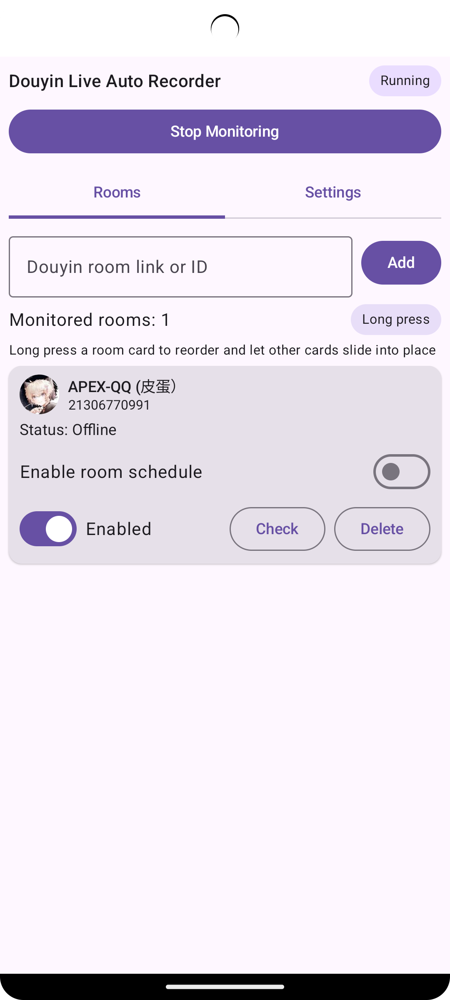
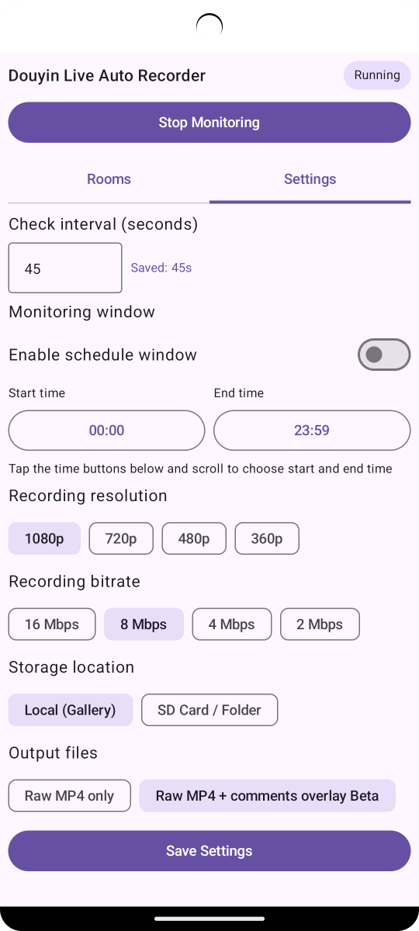

# Douyin Live Recorder (Android)

Android app for monitoring Douyin live rooms and auto-recording when a room goes live.

## 📸 Screenshots

  
  

## Current capabilities

- Add rooms by Douyin room ID or live URL.
- Foreground service checks configured rooms on a fixed interval.
- Auto-starts stream recording when a room is live.
- Saves recordings to app local storage or a user-selected document tree (for SD-card workflows).
- Supports configurable quality preference and check interval.
- Restarts monitoring after reboot when previously enabled.

## Technical notes

- The app records the pulled live stream URL, not Android screen capture.
- Stream URL parsing from Douyin page is best-effort and may break if page structure changes.
- Android still requires user-managed battery optimization settings for stable 24/7 operation.

## Build

1. Open this folder in Android Studio.
2. Let Gradle sync dependencies.
3. Run on Android 8.0+ device.

## First-time setup

1. Grant notification permission on Android 13+.
2. Select storage location (local or document tree).
3. Add rooms and tap Start Monitoring.
4. Exclude the app from battery optimization in system settings.
